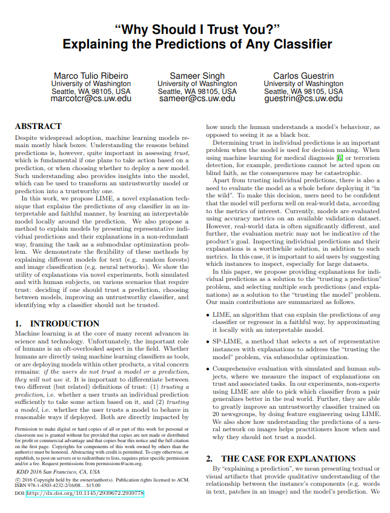
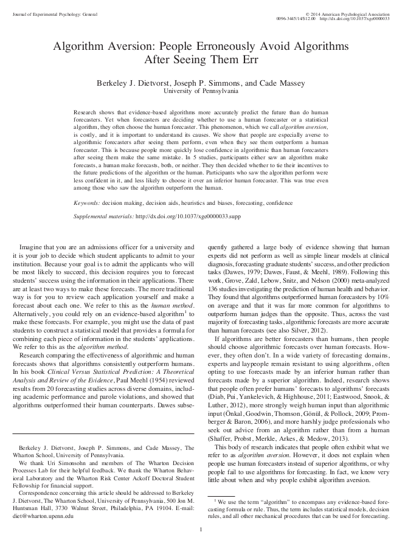

The best past of my job is that, as [John Tukey](http://www.nytimes.com/2000/07/28/us/john-tukey-85-statistician-coined-the-word-software.html?mcubz=0) famously said, **I get to play in everyone' sandbox**. It also brings positive unintended ramifications: we get to cross-pollinate fields. Perhaps, none of this is clearer than how biostatistics helps with [policing serious crime in Australia](http://press.anu.edu.au/node/162/download):

One of the authors, Robyn Attewell, writes:

>    Most of my statistical perspective is grounded in biostatistics which is the application of statistics in the study of disease and, more generally, the human condition. This is an area in which statistical principles have been well accepted and applied. I do not mean that all doctors know what a chi-square test is or could interpret a logistic regression. However, advances in knowledge in epidemiology and the treatment of disease have occurred through research which has been undertaken with the application of sound statistical methodology. The evidence base for prevention and treatment of disease has moved from personal experience and chronicles of case histories to global randomised controlled trials, longitudinal cohort studies and meta-analyses. The movement within the fields of public health and medicine towards a quantitative evidence base is so strong that the pharmaceutical industry, for example, is very highly regulated. New drug treatments are not able to be registered or receive government subsidy unless supported by a structured compilation of efficacy and safety data. It has to be proven beyond reasonable doubt that new medications work and their positive impact on the target disease outweighs any negatives through adverse side effects.

Attewell's experience mirrors mine (and I bet, that of many other statisticians), having too worked in [biostatistics](http://epi-research.org/) for many years and later migrated into energy.

Perhaps not as homogeneous as in other fields - there are indeed isolated pockets of statistical excellence in the energy industry - I routinely come across areas that not only lack statistical principles, but where I perceive a mistrust in something that's perceived as new and unfamiliar.

>    Do we over-simplify the statistical methods so that they can be grasped by our audience at the cost of being woefully wrong?

True, statistics and data science aren't easy and thinking probabilistically is admittedly hard. This presents a challenge for the statistician or the data scientist: do we over-simplify the statistical methods so that they can be grasped by our audience at the cost of being woefully wrong? Do we, instead engage in the daunting task of educating our audience in statistical principles? Or shall we present the finding as unquestionable dogma ... hey, just trust the fancy math?

>    Statistics is hard. Multiple regression is hard. Figuring out the appropriate denominator is hard. These errors aren’t so elementary. Andrew Gelman, 2016.

[Stephen John Senn](https://twitter.com/stephensenn?lang=en) captures parts of this dilemma when he writes:

>    On the other hand, the need for clear results cannot be cited as grounds for only ever using the simplest of techniques. Statistics is no different from other sciences in this respect. Just as we cannot insist that chemist determine pH using litmus paper because that is what the non-chemist remembers from school, so we cannot insist that statisticians restrict themselves to a simple T-test because this was state of the art in 1908.

Our colleagues who focus on **machine learning** (**ML**) face similar dilemmas, perhaps even more so, given that ML methods tend to be uninterpretable [black-boxes](https://www.nature.com/news/can-we-open-the-black-box-of-ai-1.20731). Two recent papers that touch on this subjects are [Ribeiro](http://www.kdd.org/kdd2016/papers/files/rfp0573-ribeiroA.pdf) et al. and [Dietvorst](http://opim.wharton.upenn.edu/risk/library/WPAF201410-AlgorthimAversion-Dietvorst-Simmons-Massey.pdf) et al.

There's no question in my mind that we need to increase the level of statistical literacy. However, the job of filling the gap left by an educational system that has historically failed to teach statistics cannot be entirely left in the hands of applied statisticians and data scientists.

>    We teach our children the mathematics of certainty - geometry and trigonometry- but not the mathematics of uncertainty, statistical thinking. [Gert Gigerenzer](https://en.wikipedia.org/wiki/Gerd_Gigerenzer).

## What to Do?

I see very encouraging signs in recent [STEM](https://en.wikipedia.org/wiki/Science,_technology,_engineering,_and_mathematics) graduates, anecdotally at least, since I see them much better prepared to recognize statistical problems.

However, the issue remains for those who have not had a chance to upgrade their skills: **how then, do we increase data and statistical literacy in the current leaders and decision makers?**

## Vendors, Consultants (and Hype) Make Things a Lot Harder
For the practicing statistician and data scientist, vendors and consultants are a double edge sword. On one hands they help by bringing to light how statistics, ML (or whatever catchy word du jour is in vogue) can help organizations; because they have a more direct communication channel with upper management, the message makes it to the top.

On the other hand, they have little vested interests in educating, let alone provide a fair view of the landscape. And in the long run, this is damaging.

Perhaps, none of this damage is clearer than what's happening with IBM Watson in health care where the "[*unrealistic timelines or promises*](https://www.technologyreview.com/s/607965/a-reality-check-for-ibms-ai-ambitions/)" are now becoming obvious and, perhaps, backfiring.

I'm not too worried about health care where the unrealistic claims are usually met with a dismissive shrug, precisely because, as Attewel writes, statistical principles have been well accepted and applied in that field.

But think about areas where statistical principles are not nearly as pervasive. Lack of statistical literacy, means our defense mechanism is unprepared. Instead, the receiver has to rely on faulty heuristics and anecdotes such as: "*I heard SmartCo is using this tool, so it must be good*" with little science to back them up. 

With time, the organization realizes those promises never materialized, the claims were unrealistic, and preconceived notions are re-inforced after a brief hiatus of hope. In a field where there are no certain truths, it's easy to throw away the baby with the bathwater.

## Summary
*    Data Science and Statistics, including more specialized branches, such as biostatistics, have wide applicability in many analytical problems
*    Statistical literacy and critical thinking present a gap that is easily exploited
*    We need to do a better job at educating people unfamiliar with data science and statistics, but this cannot be left entirely in the hands of the practitioner