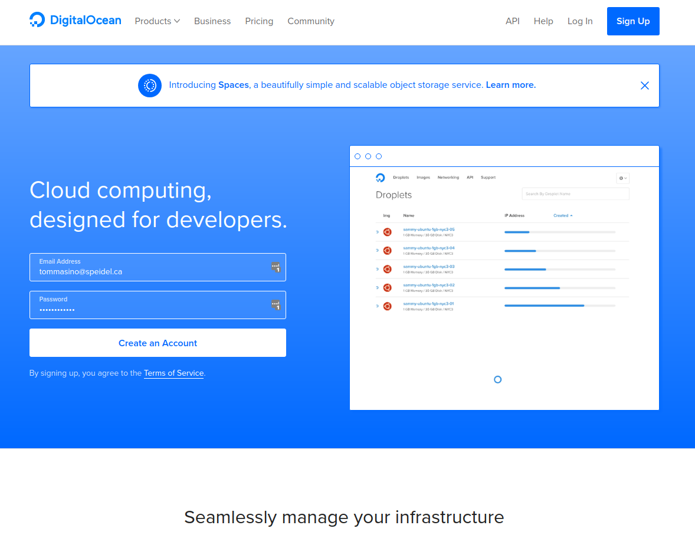

Just a few notes for those wondering how I built this site. I'm utilizing R with Yahui's fantastic package [blogdown](https://bookdown.org/yihui/blogdown/).

 

 

Blogdown utilizes [Hugo](https://gohugo.io/) which is a website generator: it compiles a bunch of files so that they can be served in a website. The nice thing about Hugo is that being open source, it has a large community that contribute themes and plugins.

While Hugo has many themes to choose from, I've had difficulties finding one that work well with blogdown.  In the end, I've settled for the popular Academic.

 

While the blog is managed in R, the files are uoloaded in my GitHub repo.  I tried to host the site in GitHub but I found it too cumbersome requiring too many workarounds.  Yihui suggested I try [Netlify](https://www.netlify.com/). I must say that was great advise because it has been a smooth ride: just link Netlify to your GitHub repo, change a couple of settings in Netlify and off you go.

The next phase is to migrate to an RStudio server version I have running on DigitalOcean so that I can publish from anywhere I have internet access. [DigitalOcean](https://www.digitalocean.com/) is a friendly, easy to use VPS. I've had RStudio server running on their systems for about 2 years now. If you want to give it a try, click the link below.

 

 

If you want to create your own blog in R, here are some good references:

*    https://bookdown.org/yihui/blogdown/
*    http://livefreeordichotomize.com/2017/07/13/introducing-the-tuftesque-blogdown-theme/
*    http://livefreeordichotomize.com/2017/08/08/how-to-make-an-rmarkdown-website/
