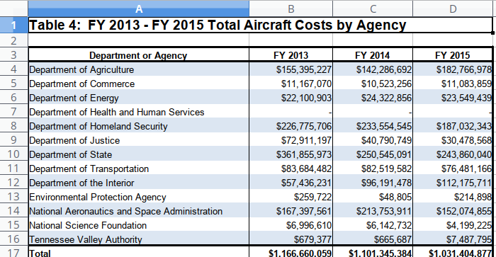

I recently came across a fairly simple table of results. Being affected by an incurable condition called "graphical and tabular intolerance disorder", I felt compelled to do something.

The table comes from the US Open Dataset initiative. In particular, the Federal Aviation Interactive Reporting System (FAIRS). You can read more about it [here](https://www.gsa.gov/policy-regulations/policy/aviation-management-policy/aviation-regulations-and-guidance-overview/report-government-aircraft-data).

The original table is contained in the [Excel spreadsheet](https://www.gsa.gov/cdnstatic/FY_2015_Aviation_Open_Data_Set__dtd_04-08-16.xlsx) worksheet `Table 4 Total Costs`. 

<br>



<br>

This is a poorly formatted table. In the 1981 article "[The Problem of Numeracy](https://www.stat.washington.edu/pds/stat423/Documents/Ehrenberg.numeracy.pdf)" (The American Statistician), Ehrenberg provides a number of valuable suggestions to improve the way data is presented. 


>    *Lack of numeracy is due mainly to the way data are presented. Most tables of data can be improved by following a few simple rules, such as drastic rounding, ordering the rows of a table by size, and giving a brief verbal summary of the data*.

More than thirty years later, Ehrenberg's suggestions are echoed by Swires-Hennessy in [Presenting Data: How to Communicate Your Message Effectively](https://www.amazon.com/Presenting-Data-Communicate-Message-Effectively/dp/1118489594). 

Here, I will incorporate some of the best practices to improve the display of the information in this table. I'll be using R, but for this task any spreadsheet tool will do. I'll show the R code as I go along. Non-R users can skip these and jump to the end result.


## Download the Data

First we download the data and assign it to the object `avi` which is a dataframe:

```{r, echo = TRUE, warning=FALSE, message=FALSE}
## Packages
library(readxl)
library(dplyr)
library(tibble)
library(ggplot2)
library(knitr)
library(kableExtra)


## Download data
url <- "https://www.gsa.gov/cdnstatic/FY_2015_Aviation_Open_Data_Set__dtd_04-08-16.xlsx"
file <- "avi.xlsx"
if (!file.exists(file)) download.file(url, file)

avi <- read_excel("/home/tspeidel/GoogleDrive/dsblog/dsblog/avi.xlsx", 
    sheet = "Table 4 Total Costs", skip = 2)

kable(avi)

```


Ok that's a good start. 

<br>

## Shortening the Numbers
We usually don't require utmost precision in a summary table and having long numbers is just going to tax our cognitive abilities.

Ehrenberg writes: "*Scanning different figures or doing mental arithmetic are forms of mental interruption. This explains why we have such difficulty using longer numbers*". Edward Tufte makes similar point in his work while the Nobel proze winner Herbert Simon provides much of the foundational rationale. 

We have around 9 figures. There's absolutely no reason to preserve these. So we are going to divide them by 1,000,000 to ease our cognitive strain:


```{r, warning=FALSE, message=FALSE}
avi %>%
     mutate(`Department or Agency` = as.factor(`Department or Agency`)) %>%
     mutate_if(is.character, as.numeric) %>%
     mutate_if(is.numeric, funs(as.numeric(./10^6))) %>%
     as.tibble() -> avi
     
kable(avi)

```

That's better. Notice how we still have too many degits. This is unecessary precision. We'll get back to that later since we'll do it in one pass when the table is ready.

<br>

## Marginals
The next step is to add marginals. It would help if we had a column with the mean cost by department for the three years. This is important because it will provide the sorting order. R usually thinks vector-wise (or column-wise) and I'm too lazy to [melt](https://www.rdocumentation.org/packages/reshape2/versions/1.4.3/topics/melt.data.frame) the data. The little known `rowwise()` function comes to the rescue:

```{r}
avi %>%
     rowwise() %>% 
     mutate(`Mean Yearly Cost` = mean(c(`FY 2013`, `FY 2014`, `FY 2015`), na.rm = TRUE)) %>%
     ungroup() %>%
     as.tibble() -> avi

kable(avi)


```

<br>

## Order

The table appears to be sorted in alphabetical order.  This is not ideal.  Tufte suggests humnans are pretty good at finding information by eye scanning. What we are not good at is to sort the data by memory: we'll loose track after a few rows of data. So let's order the data, highest to lowest. What do we sort by? The mean cost, that's what it's for:

```{r}
avi %>%
     arrange(desc(`Mean Yearly Cost`)) %>%
     as.tibble() -> avi

avi <- avi[c(2:14, 1), ] 
kable(avi)
     
```


## Back to the number of figures
Now that we have a table let's round off all the numbers. This is a bit tricky: if we round off all the numbers to 0 decimal places, any number below 1, like Tennessee, will get 0.  It turns out we can apply a conditional formatting. This is a bit ugly, but here it goes:

```{r}
avi %>%
     mutate_if(is.numeric, funs(if_else(. < 10, format(round(., 1), 1), format(round(., 0), 0)))) %>%
     as.tibble() -> avi

kable(avi)

```


## Prettify
Finally, we prettify the table for maximum readibility.

### A flat table

```{r}
# kable(avi, "html", align = "l", table.attr='class="flat-table"') %>%
#   kable_styling(bootstrap_options = c("striped", "hover", "condensed"), font_size = 12) %>%
#   row_spec(nrow(avi), bold = T) %>%
#   footnote(general = "*In millions of dollars*")


library(formattable)

formattable(avi, list(
  `Mean Yearly Cost` = color_tile("white", "red")
))

```

### An Interactive Table

```{r}
library(DT)

options(DT.fillContainer = FALSE)

datatable(avi,
          fillContainer = FALSE,
          style = 'bootstrap', 
          class = 'table-hover table-condensed stripe',
          extensions = 'Buttons',
          rownames = FALSE,
          filter = 'top',
          width = 1200,
          options = list(
            keys = TRUE,     
            autoWidth = TRUE,
            pageLength = 15,
            searching = FALSE, 
            dom = 'Bfrtip',
            searchHighlight = TRUE,
            buttons = c('copy', 'csv', 'excel', 'pdf', 'print'))) %>%
  formatStyle("Mean Yearly Cost",
    background = styleColorBar(as.integer(avi$`Mean Yearly Cost`), '#FFB9BB'),
    backgroundSize = '100% 80%',
    backgroundRepeat = 'no-repeat')

```


# Final Thoughts
A lot has changed since Ehrenberg's 1981 article. For one thing, most communication nowadays is done via screen, so what worked well for print does not necessarily work well for screen. With the focus on web media, we know have access to multiple style elements that attempt to achieve good readability. For instance, alternative striped rows, sorting, bar graph overlay etc.

The progress has made it possible to overlay additional style elements to improve cognition. For example, we have all seen green and orange arrows within a table telling if a particular value has gone up or down. These are not informative in my opinion, in fact, I find them misleading because they create a sense of urgency where it might exist just because of random variation. However, one could include in the table a sparkline with reference bands.


